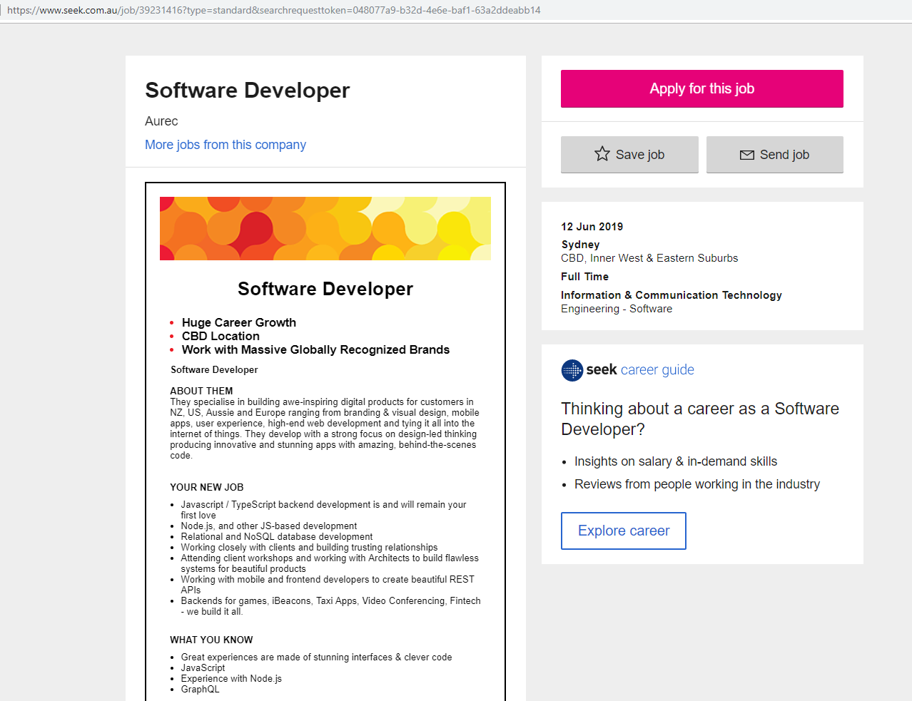
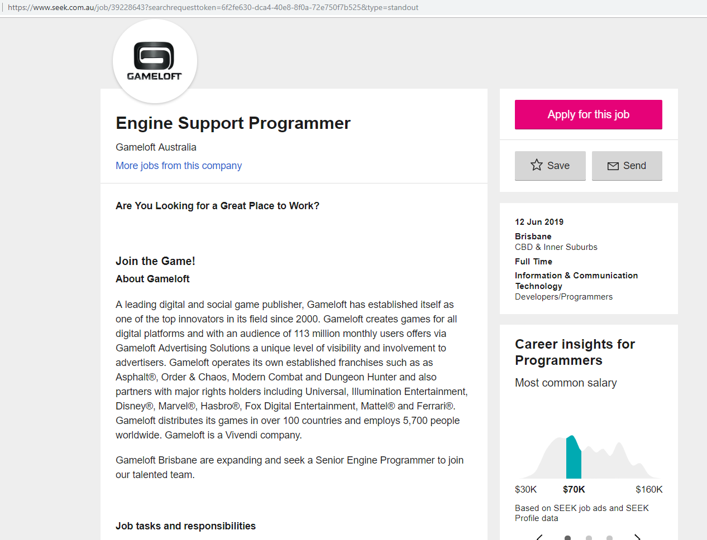

# About Me
Name: Samuel Wood.
Student number: S3794612.
Email: S3794612@STUDENT.RMIT.EDU.AU
# Bio
I am Australian born in Perth, WA, Australia. I am 21 years old and graduated year 12 in 2015. I enjoy playing video games in my spare time away from work and study. When I was 10 years old my family and I went to Tasmania for a holiday, there my parents bought me a 3x3x3 rubik's cube. Now I am able to solve that same rubik's cube in just under 2 minutes.
# Interest in IT
I have always had an interest and passion for Computing and Information Technology since I was a child. I enjoyed building computers, learning how computers worked and playing video games with my dad in my spare time. I was exposed to computer games and operating computer systems at a young age, I began using Windows 95 when I was about 6 years old. I have continued to use computers through my student life and beyond. Through highschool I entered programming and robotics events and also became knowledgable in using Adobe Photoshop in my photography class recieving a 97% by the end of year 12.
# Ideal Job
I personally love the idea of working from home. Due to this urge to not have to travel to work every morning, my dream job would be becoming an online personality, something like a Streamer or Youtuber, working from home and creating content for _MY_ community. This itself does not actually require a degree, nor true knowledge of IT, although it is in the space of IT and also I believe this job is quite unrealistic. Due to this belief I would love to be a freelance programmer, or work on projects such as game developement of software developement. (As my dream is to be my own boss, below are some jobs that are close to what I would like to do).
1. [Software Developer](https://www.seek.com.au/job/39231416?type=standard&searchrequesttoken=048077a9-b32d-4e6e-baf1-63a2ddeabb14)

2. [Video Game Developer](https://www.seek.com.au/job/39228643?searchrequesttoken=6f2fe630-dca4-40e8-8f0a-72e750f7b525&type=standout)

# Myers-Briggs Test
**Result:** ISFP-T 'Adventurer' - test taken [here.](https://www.16personalities.com)
# Learning Test
**Result:** Auditory/Visual learner 35% Auditory, 35% Visual, 30% Tactile - test taken [here.](http://www.educationplanner.org/students/self-assessments/learning-styles.shtml)
# Career Test
**Result:** Holland code AICERS, Artistic, top three jobs suited to me are: Writer, Desktop Publisher and Animator - test taken [here.](https://www.123test.com/career-test/)
# Evaluation of Results
These tests are fun to do and to compare with others to see how similar, or different, you are to each other. I personally think these tests are too volatile, it's very dependant on you current mood, situation, lifestyle etc. These tests I do not believe give an accurate insite to someones personality. It may give a guide, or a rough estimate as to how someone thinks or acts in given circumstances. I do not believe this will effect the way I will interact with a team, as no matter the information given, I am still going to remain myself and not change.

# Project Idea
## Overview 100
I would like to do a simple video game in an engine not yet decided.
## Motivation 100
Video games are something that I will have to be able to create at some point in my IT career reguardless. I've done designs of basic games with tools such as Sketch and Game Maker, but never in a proper game engine or using code such as JavaScript. This would be a big learning curve for me, and would allow me to respect the large triple A titles I play in my spare time.
## Description 500
The game I am thinking of will act similar to the well-known game Mario. A side scroller, with the objective being to reach the 'finish line'. Adding enemies, checkpoints, lives, and obstacles in the players way. A level selector, with multiple (2-3) levels with a variety of different themes.
## Tools and Technologies 100
I would like to try the Unity Engine to code this, but I am unsure yet as to what exaclty would be the best to use.
## Skills Required 100
Basic coding skills will be required to perform the task, along with some very basic artistic skills for level design and character design. Animation will be a bonus if able to implement. As Unity uses C# code, it would take a fair bit of research in order to take on even a simple tast, as I personally have no prior knowledge in C at all.
## Outcocme 100
If the game is successfully created, then I will have gained skills required to make basic games. This will increase my knowledge in the IT space and allow me to continue to persue a degree in IT and then able to reference this unit in potentially a job interview post study in a Game Studio.

## Welcome to GitHub Pages

You can use the [editor on GitHub](https://github.com/samwood97/Profile/edit/master/index.md) to maintain and preview the content for your website in Markdown files.

Whenever you commit to this repository, GitHub Pages will run [Jekyll](https://jekyllrb.com/) to rebuild the pages in your site, from the content in your Markdown files.

### Markdown

Markdown is a lightweight and easy-to-use syntax for styling your writing. It includes conventions for

```markdown
Syntax highlighted code block

# Header 1
## Header 2
### Header 3

- Bulleted
- List

1. Numbered
2. List

**Bold** and _Italic_ and `Code` text

[Link](url) and 
```

For more details see [GitHub Flavored Markdown](https://guides.github.com/features/mastering-markdown/).

### Jekyll Themes

Your Pages site will use the layout and styles from the Jekyll theme you have selected in your [repository settings](https://github.com/samwood97/Profile/settings). The name of this theme is saved in the Jekyll `_config.yml` configuration file.

### Support or Contact

Having trouble with Pages? Check out our [documentation](https://help.github.com/categories/github-pages-basics/) or [contact support](https://github.com/contact) and we’ll help you sort it out.
